# EmployeeEvaluator

EmployeeEvaluator is a web app for annual performance appraisals and talent reviews. Administrators set up the company, cycles, and forms. Managers rate the people in their groups. Employees complete their own column when a group allows it. Finished reviews print from the browser.

The seeded company is Sample Company. It has a West and East organization, a 2026 performance-appraisal cycle, and a 2026 talent-review cycle.

## Sign in

Open [http://localhost:3000](http://localhost:3000). Administrators, managers, and employees use the same sign-in page.

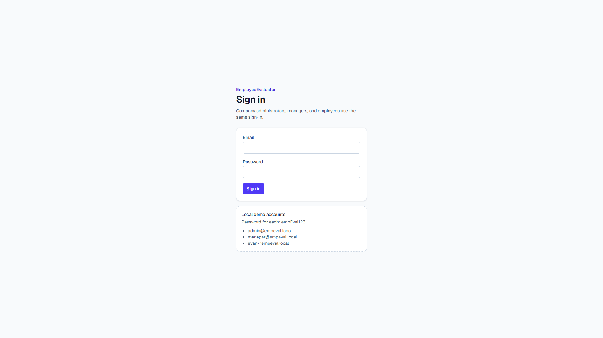

After `npm run db:seed`, these accounts all use the password `empEval123!`:

| Email | Role | What they can do |
| --- | --- | --- |
| admin@empeval.local | Administrator | The whole company, including setup |
| manager@empeval.local | Manager | Groups they own, and the groups under those |
| evan@empeval.local | Employee | Their own appraisal when the group allows self-editing |

Inactive people cannot sign in.

## Run it locally

You need Node.js and a local PostgreSQL server.

1. Create a database and a user that can use it. The example below uses database `empEval` and user `empEval`. Choose your own password.

2. Copy the environment file and fill in the two values:

   ```bash
   cp .env.example .env
   ```

   `DATABASE_URL` is the Postgres connection string. If the password contains `!` or another reserved character, encode it in the URL (`!` becomes `%21`). `AUTH_SECRET` is a long random string used to sign the session cookie. `.env` stays on your machine and is not committed.

3. Install, create the tables, and load the sample company:

   ```bash
   npm install
   npx prisma db push
   npm run db:seed
   npm run dev
   ```

4. Open [http://localhost:3000](http://localhost:3000) and sign in as `admin@empeval.local`.

`npm run db:seed` replaces the company data with the sample roster. The menu is in the top-left corner. Setup is available to administrators.

## Page help

Every application page has a **?** beside the title. It explains how that page works. Click it again, click outside it, or press Escape to close it.

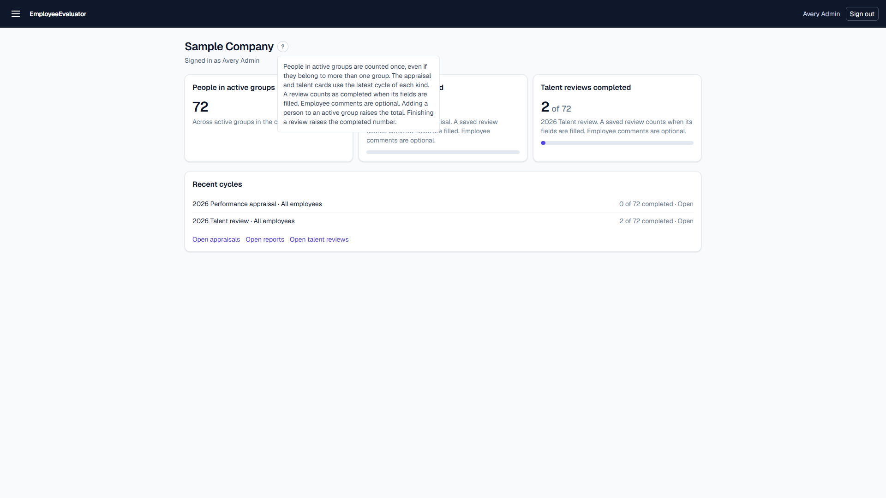

## Dashboard

The dashboard counts people who belong to an active group. A person in more than one group is counted once.

The appraisal and talent cards use the latest cycle of each kind. A review counts as completed when its fields are filled. Employee comments are optional, so a finished appraisal can still have those blank. Adding someone to an active group raises the total. Finishing a review raises the completed number.

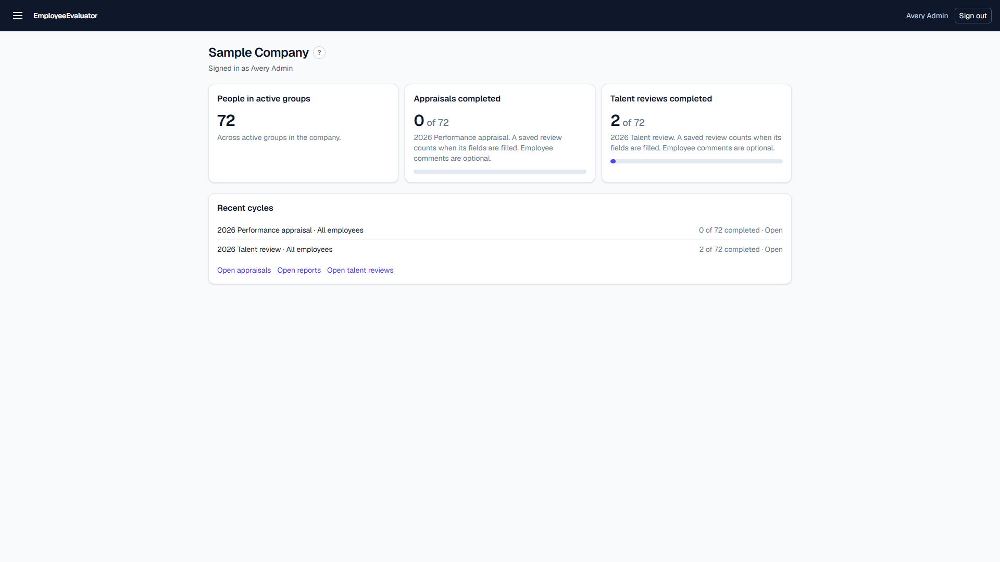

## Performance appraisals

Choose a cycle and a group. The employee list shows only people in that group. Search by name or employee number.

Each person is marked:

- **(C)** complete. Every counted field is filled. Employee comments do not change this mark.
- **(P)** saved, with at least one counted field still blank.
- **(I)** not started.

Employees fill their column. Managers fill the supervisor column, including the approver signature. Key and scorecard ratings are suggested from the amounts entered. Points from the selected levels are added, and the total is compared with the template's Exceeds and Meets minimums.

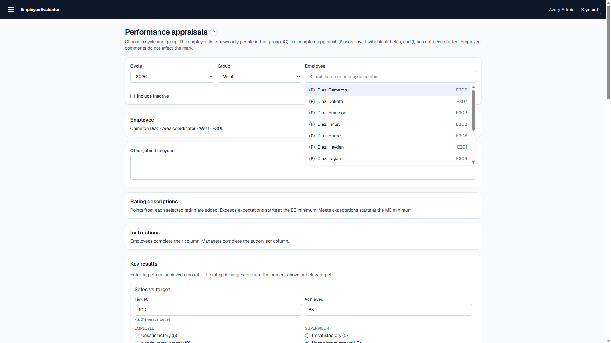

The print view is the appraisal report. Employee, supervisor, and approver signatures share one row.

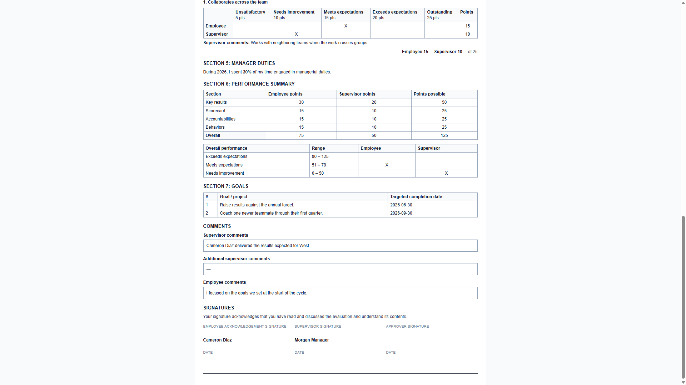

## Talent reviews

Talent reviews use the same cycle, group, and employee picker, with the same **(C)**, **(P)**, and **(I)** marks. A talent review is complete when every field on the form is filled.

Rank the group by performance and by potential, then record performance, potential, trend, short- and long-term plans, relocation, strengths, and development needs.

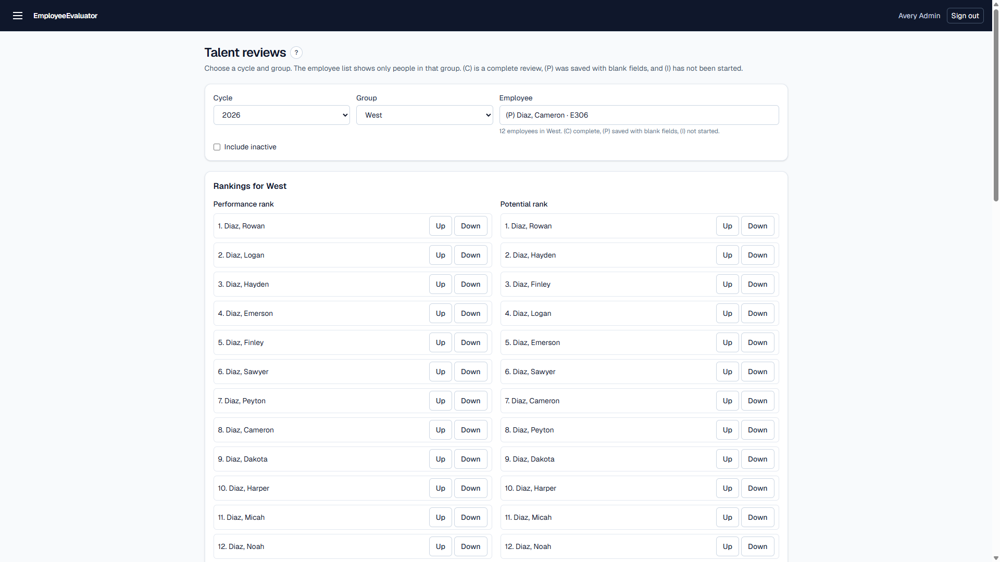

## Reports and the 9-box

The reports table lists saved appraisals and talent reviews. Search or filter each column, then open the print view.

The talent 9-box starts from a cycle and a group:

- **By group** prints one grid for each group in the branch that has a talent review. A person stays on the group where the review was saved.
- **Rolled up** prints one grid for the selected group and every group under it.
- **Branch, then groups** prints the rolled-up grid first, then each group.

Performance increases up the grid. Potential increases to the right. Outstanding and Exceeds expectations are High performance. Meets expectations is Acceptable. Needs improvement and Unsatisfactory are Poor. High potential stays High, Medium becomes Uncertain, and Low stays Low.

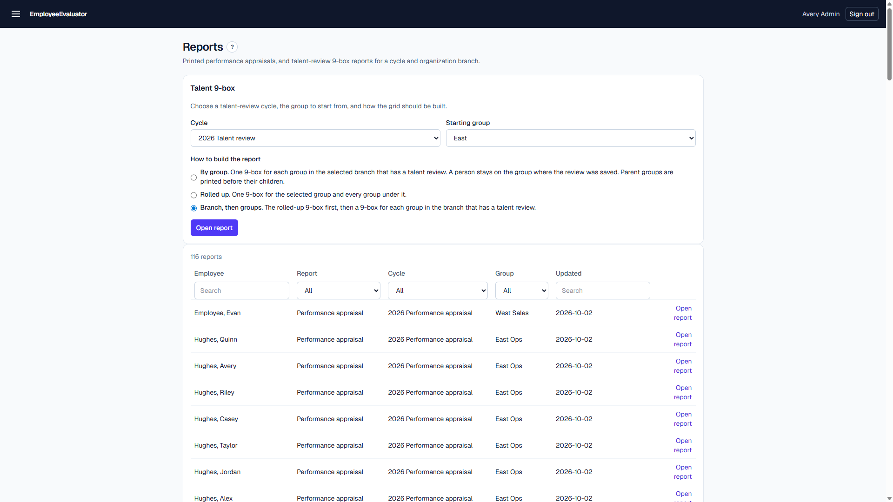

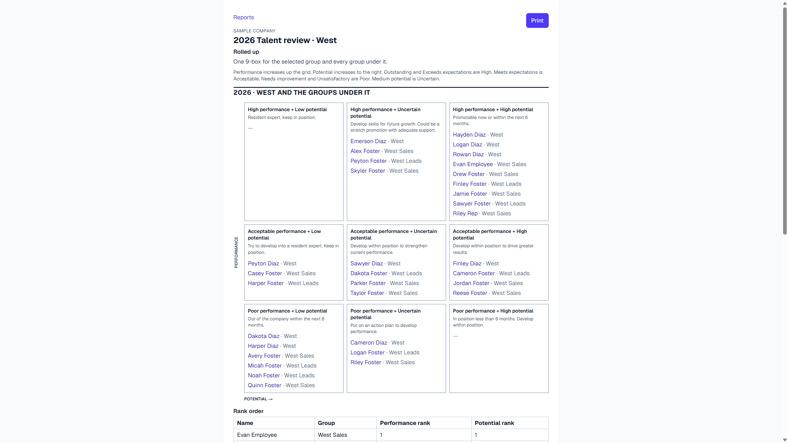


## People

Search name, email, and employee number. Filter Role and Status from the column headers. Add a person here, then add them to a group on the Organization page so they appear on appraisals and talent reviews.

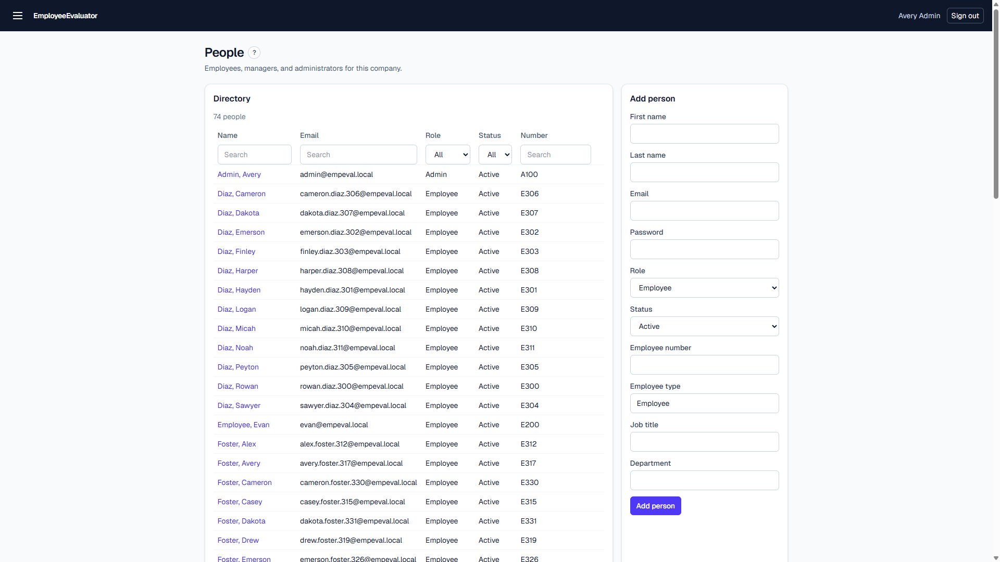

## Organization

Groups form the company tree. Members are the people evaluated in that group. Owners can rate people in the group and in the groups under it. Search the member and owner lists, then save.

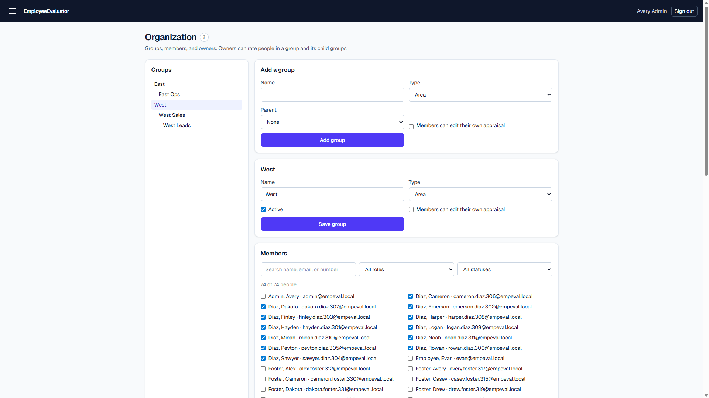

## Cycles

A cycle is one year's performance appraisal or talent review. Assign the groups that will be evaluated and set the open and close dates. Lock a cycle when scoring should stop. After a cycle is locked, one person's evaluation can still be unlocked.

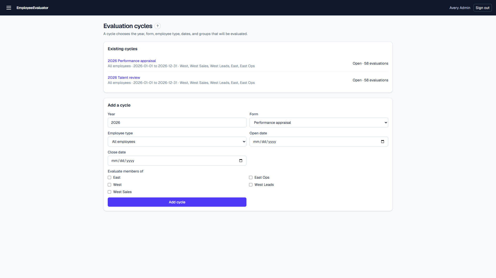

## Form templates

A template is the appraisal form for one year and employee type. Open it to choose which sections appear, edit the wording, attach catalog items, and set the point cutoffs for Exceeds expectations and Meets expectations.

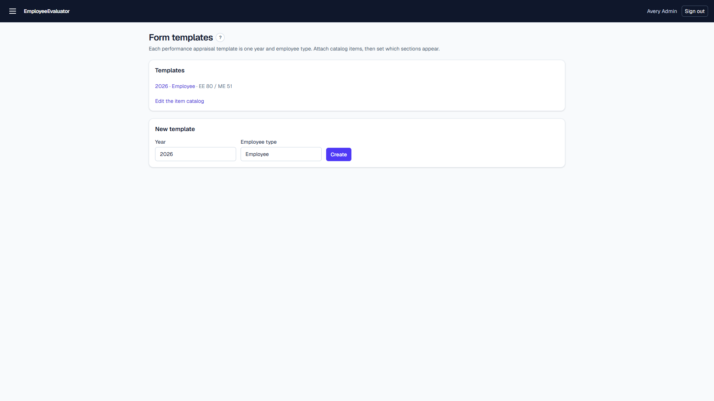

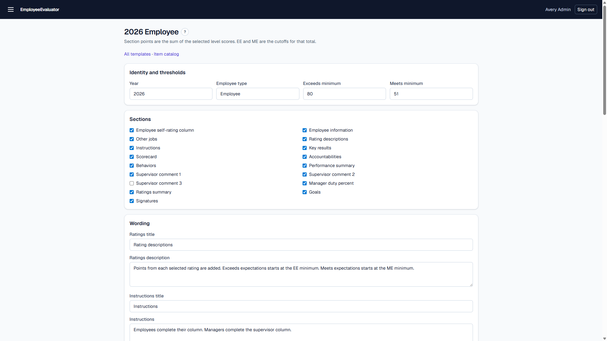

## Item catalog

Key results, scorecard items, accountabilities, and behaviors are the lines on an appraisal. Each item has five rating levels with points. Key and scorecard items also have a minimum that suggests the rating from the entered amounts. 

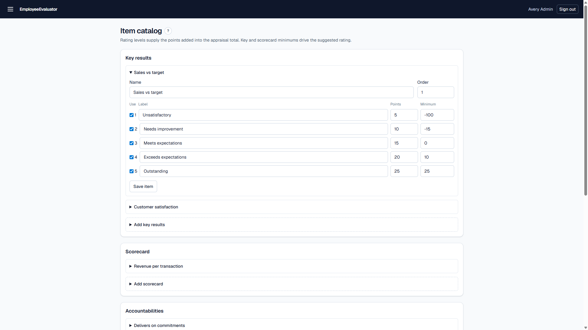

